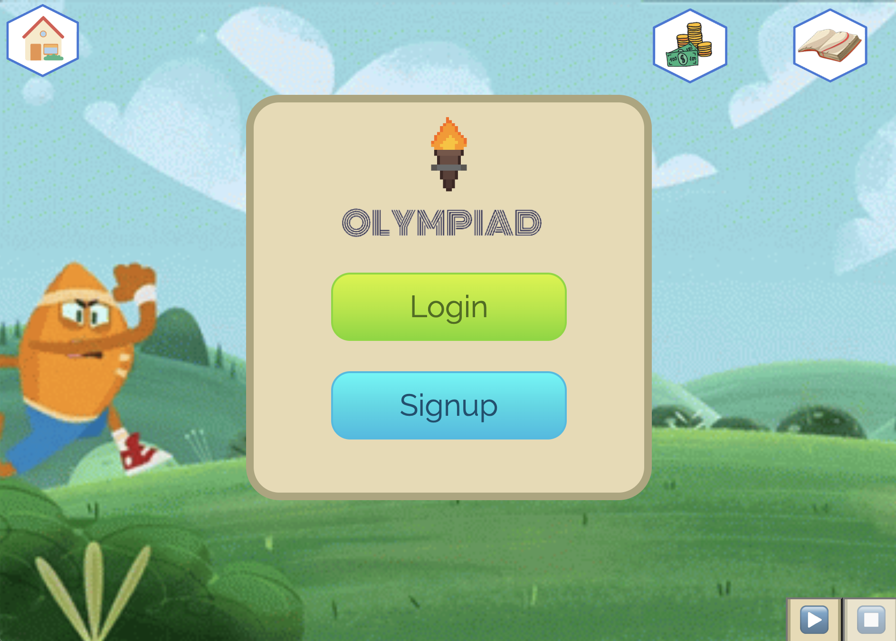
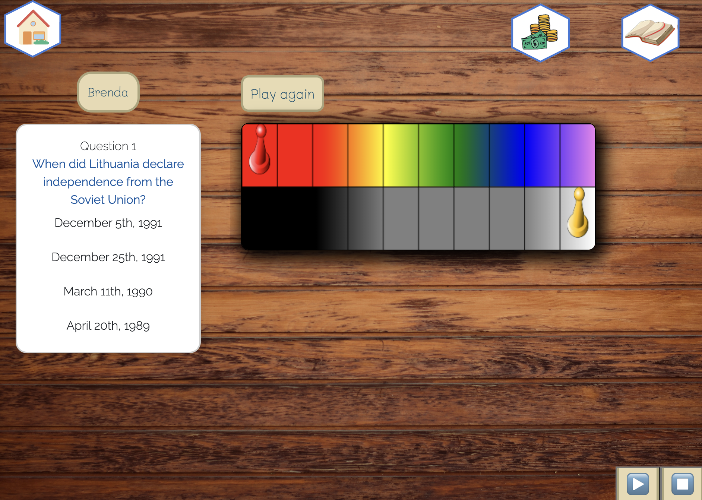
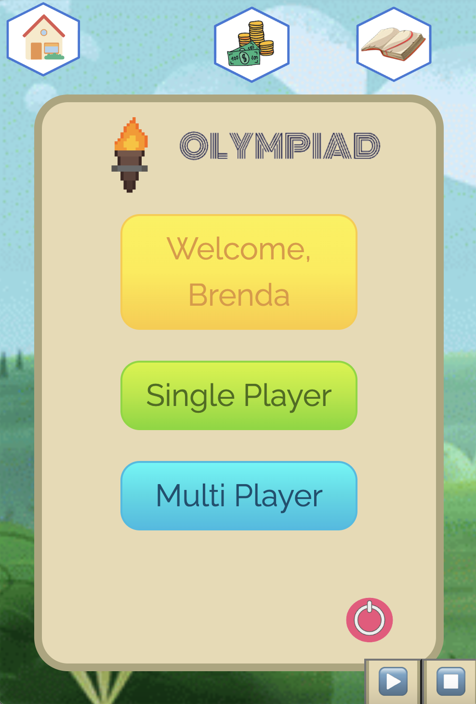
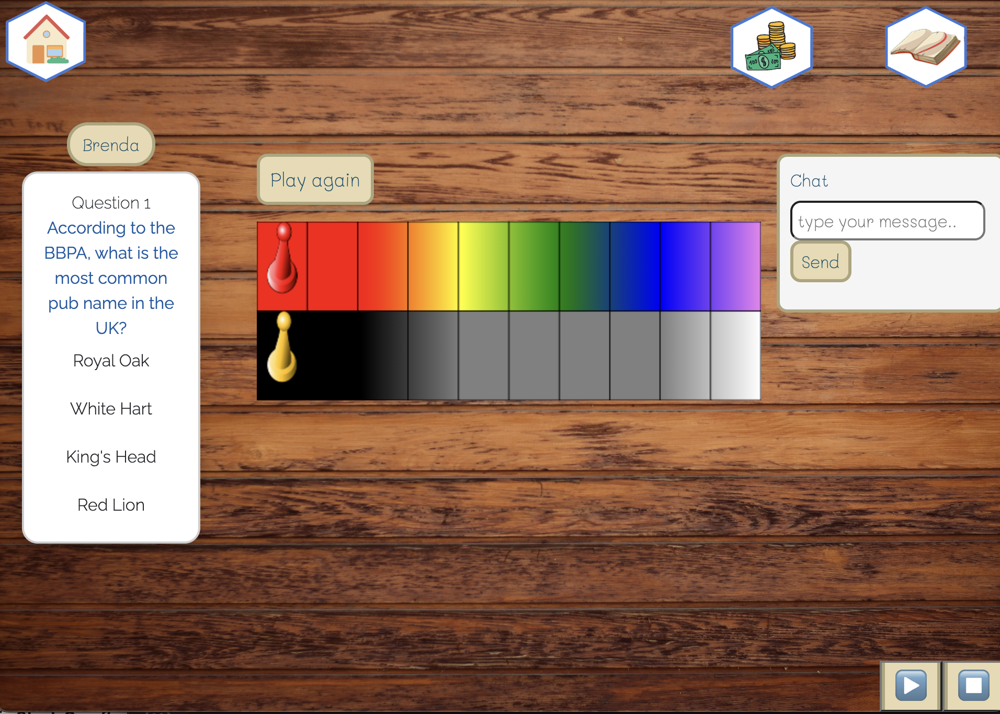

# Olympiad
### License

## Demo
[Here is a demo of Olympiad in action!]() 

## Description

This application was developed with a mission to unite fans of trivia. Our goal was to create a trivia game where users can play solitary or invite friends and build a community. This game was insprired by the popular board game, Marathon, played in Mexico. The premise of this game is to play against one's own ignorance and win! 

## Instructions 📝
Click on the link above to access this game application. 

Users can make an account by signing up and providing a name, email, and creating a password. You can login to your account by entering your email and password. Once you've logged in, users initiate a single player game or a multiplayer game. Additionally, players can access game play history by clicking on the yellow welcome button.

### How To Play 

#### Single Player

To play the single player option, players will be up against their own ignorance represented by the dark color gradient. Your token is represented on the colorful gradient. As the player answer questions correctly, the token will advance forward towards the finish line. If the player answers the questions incorrectly, their ignorance token will advance towards its finish line. The token that reaches the their finish line first will win the game! Will you beat out your own ignorance? 

#### Multiplayer

To access the muliplayer game one player should first login. Once they are logged in, the player can share their URL with player 2. Player 2 should copy and paste the URL into their browser. This will give both players access to the player 1's profile. 
From this screen, both players should select the multiplayer option to begin playing. 

Once both players have accessed the game, each player will take turns answering the questions. You will be playing against your friends! If a player gets a question correct, their game piece will move forward towards the finish line. Player 1 and player 2 will continue taking turns until the first player to reach the end wins! You can chat with your friend while you play!

# Team ✨

Thanks goes to these wonderful people 
<table>
  <tr>
<td align="center"><a href="https://github.com/Itzelmariana"> <b>Itzel Cole </b></a></td>
<td align="center"><a href="https://github.com/Dusticcus"> <b> Dustin Safady</b></a></td>
<td align="center"><a href="https://github.com/aaronhdm"> <b>Aaron Hernandez </b></a></td>
<td align="center"><a href="https://github.com/bralvis2"> <b>Brenda Alvis</b></a></td>
 </tr>
</table>
